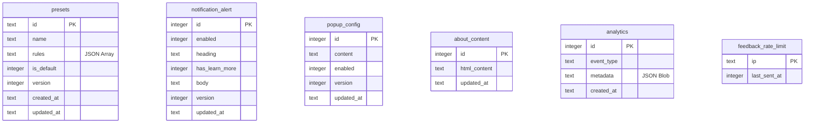

<div align="center">

# 🧹 TxT Sanitizer

### A powerful, modern text cleaning and sanitization tool

[](https://react.dev/)
[](https://nextjs.org/)
[](https://tailwindcss.com/)
[](https://daisyui.com/)
[](#)

**Clean, format, and sanitize text content with predefined or custom rules**

[🚀 Live Site](https://txt-sanitizer.pages.dev) • [📖 Documentation](file:///c:/Users/Sano/Documents/Personal%20Projects/txt-sanitizerV2/docs/v2-architecture.md) • [🐛 Issues](https://github.com/sanwar-hosen/TxT-Sanitizer/issues) • [💡 Feature Requests](https://github.com/sanwar-hosen/TxT-Sanitizer/issues/new)

</div>

---

> [!NOTE]
> **Major Version Update:** TxT Sanitizer has been upgraded to a major version (formerly V1 built on React + Vite) now built on Next.js (App Router), Tailwind CSS v4, DaisyUI v5, and Cloudflare Pages/D1. It is a serverless, edge-ready, fully themeable text processing application that enables creators, developers, and platform professionals (e.g., Fiverr sellers, writers, AI engineers) to instantly sanitize copy, strip structural markers, bypass restricted phrases, and manage custom workflows with zero overhead.


## 🚀 Key Features

### 💻 Advanced Workspace & Multitasking
* **Dynamic Multi-Tab Workspace:** Open and edit up to **5 tabs** simultaneously. Tab states, including raw inputs, outputs, select presets, and highlighting ranges, are persisted in `localStorage` so you never lose progress on reload.
* **Auto-Labeling Tabs:** Tab names update dynamically in real time to the first 12 characters of your input string (complete with smooth ellipses truncation). Tabs fall back to static identifiers (`Tab 1`, `Tab 2`, etc.) when empty.
* **Dual Statistics Engine:** Real-time character and word count tracking for both input and sanitized output panes.

### ⚙️ High-Precision Sanitization Engine
* **Sequential Processing Pipeline:** Preset rules are executed sequentially based on priority numbers (lower priority runs first). Each rule transforms the result of the previous rule.
* **Smart Case-Preserving Replacements:** Performs case-insensitive matching but keeps the original casing intact if it is a structural replacement (e.g., matching `PAY` with a rule finding `pay` and replacing with `pa-y` outputs `PA-Y`). It applies the template's structure to the match.
* **Stable Match Tracking:** High-speed string matching is entirely literal-based (no regex parsing execution inside core rules) to guarantee performance stability.

### 🎨 Rich Interactive Highlighting & Segment Restore
* **Double Highlighting System:** Distinct, non-overlapping colors for different states:
  * **Preset Matches:** Amber highlights (`bg-amber-200` / dark: `bg-amber-800/40`) indicate transformations done by sanitizer presets.
  * **Search Results:** Blue highlights indicate current query matches from the Find & Replace panel.
* **Zero-Layout-Shift Segment Restore:** Hovering over any sanitized segment in the output reveals a floating restore button (under your cursor). Click to instantly restore that specific piece of text to its pre-sanitized state without causing visual jumps or re-running the full sanitization pipeline.

### 🔍 Edge-Level Find & Replace Tool
* **Interactive Slide-In Drawer:** Toggleable via the 🔍 icon in the Output panel header or via `Ctrl+Shift+F`.
* **Complete Controls:** Case-sensitivity toggling, previous/next match navigation, and discrete *Replace One* vs *Replace All* actions.

### 🎛️ Dual-Mode Processing
* **Automatic Mode (Default):** Runs sanitization in real time as you type. Dims out/hides the manual "Sanitize" button to keep the workspace clean.
* **Manual Mode:** Reveals the primary "Sanitize" button (or triggers via `Ctrl+Enter`) and logs entries into the History page.
* **History Page Interlock:** If Auto Mode is active, the History page displays a helpful prompt with an "Enable Manual Mode" shortcut button, helping users avoid empty histories.

### 🛡️ Admin Dashboard & CMS (`/admin`)
* **Secure Admin Access:** Securely guarded via an environment-configured `ADMIN_PASSWORD` and an `HttpOnly` session cookie (valid for 24 hours).
* **System Presets CRUD:** Create, update, and delete system presets stored in the Cloudflare D1 database.
* **Notification Banner CMS:** Create slide-in top announcement bars, toggle "Learn More" links, write custom alert bodies, and trigger a "Re-show to all users" cache-busting version bump.
* **Dynamic About Page CMS:** Visual HTML/Markdown editor to update the About page content in real-time, fetching content server-side for maximum SEO speed.
* **Ads Toggle Controls:** Control reserved slot container displays (`#ad-below-navbar` and `#ad-sidebar`) from the admin panel.
* **Edge Analytics:** Real-time interaction tracker. Renders responsive, theme-aware **SVG line charts** of Page Views, Sanitizations, and Feedbacks over customizable timeframes (Last 30 Days, 6 Months, or 12 Months) alongside top presets statistics.
* **Email System Config:** Monitor the status of your feedback recipient configuration directly from the panel.

### 💎 Rich Aesthetics & UX
* **15 Dynamic Themes:** Powered by DaisyUI v5. Seamlessly switch between brand-tailored light/dark themes, plus Cupcake, Emerald, Synthwave, Retro, Halloween, Forest, Wireframe, Dracula, Night, Coffee, Abyss, Sunset, and Silk themes.
* **Drag-Reorder Animations:** The custom Preset Editor modal supports smooth CSS animations (`shiftUp`/`shiftDown`) and top/bottom indicator lines when reordering rules, giving users visual feedback during sorting.
* **Slide-In Notification Alert Banner:** Collapses down to a tiny 4px header strip until hovered, sliding down into view to keep content readable.
* **Edge-Native Feedback System:** Submits user queries via the **Resend API** (Edge-compatible). Includes a D1 rate-limiting safety filter (1 mail per IP per 24 hours) and a live countdown ticker in the modal UI.

---

## 🛠️ Tech Stack

| Layer | Technology | Description |
|---|---|---|
| **Framework** | Next.js 16 (App Router) | React server component rendering for static content/SEO, Client-side workspaces. |
| **Runtime** | Bun / Node.js | Fast development scripts and package lock tracking. |
| **Styling** | Tailwind CSS v4 & DaisyUI v5 | Custom CSS variables, responsive positioning, utility themes. |
| **Database** | Cloudflare D1 (SQLite) | Edge-native database containing presets, CMS content, alerts, and analytics. |
| **Mail Delivery** | Resend API | Serverless, Edge-compatible email delivery via direct REST calls. |
| **State Manager** | React Hooks + Context | Clean local state propagation without heavy external state libraries. |
| **Deployment** | Cloudflare Pages + Wrangler | Seamless serverless deployment with edge routes. |

---

## 📂 Codebase Directory Structure

```
├── .agent/                  # Custom agent scripts and UI/UX skills specs
├── docs/                    # Documentation and architecture diagrams
│   ├── LEGACY_SYSTEM_SPEC.md# V1 specifications reference
│   ├── ui-spec.md           # UI styles guidelines
│   ├── v2-architecture.md   # Architectural boundaries and modules
│   └── schema.sql           # SQLite migration seeds for Cloudflare D1
├── public/                  # Static web assets (icons, images)
├── src/
│   ├── app/                 # Next.js App Router folders
│   │   ├── page.tsx         # Homepage entry
│   │   ├── HomeClient.tsx   # Client-side workspace coordinator
│   │   ├── globals.css      # Core styles & Tailwind directives
│   │   ├── layout.tsx       # Root layout containing ads and alert banners
│   │   ├── about/           # About page router (SSR SEO page)
│   │   ├── admin/           # Admin panel router (presets, config, analytics)
│   │   ├── history/         # Sanitization history client page
│   │   ├── settings/        # User settings & preset editor client page
│   │   └── api/             # API Endpoints (Edge Routes)
│   │       ├── presets/     # System presets fetch and CRUD
│   │       ├── notification-alert/ # Slide-in alert configuration fetch
│   │       ├── about/       # Dynamic About CMS routing
│   │       ├── feedback/    # Rate-limited feedback delivery via Resend
│   │       ├── analytics/   # Event logging endpoints
│   │       ├── ads/         # Ads layout config toggles
│   │       └── admin/       # Login, Logout, and secure resource APIs
│   │
│   ├── components/          # Reusable React components
│   │   ├── navbar/          # Header menu & Theme selector dropdowns
│   │   ├── footer/          # Footer links & Feedback submission modals
│   │   ├── tabs/            # Multi-tab workspace selector
│   │   ├── sanitizer/       # Input/Output text editors, Find & Replace tool
│   │   ├── history/         # Expanded history cards and management tools
│   │   ├── settings/        # Import/Export tools, local StorageManager
│   │   ├── admin/           # Admin CMS, Analytics charts, and status controls
│   │   ├── analytics/       # Page views and event tracking script
│   │   ├── notification/    # Collapsible hover-reveal notification banner
│   │   └── shared/          # Centralized DaisyUI components (Modal, Button, Alert)
│   │
│   ├── hooks/               # Custom React state hooks
│   │   ├── useTabs.ts       # Workspace tab management & localStorage sync
│   │   ├── usePresets.ts    # Merging of user presets + system presets
│   │   ├── useSystemPresets.ts # Caching of system database presets
│   │   ├── useFindReplace.ts# Find & Replace navigation and text substitution
│   │   ├── useHistory.ts    # Sanitization history cap & management
│   │   └── useDarkMode.ts   # Dark mode class selector & DaisyUI bindings
│   │
│   ├── lib/                 # Core business logic
│   │   ├── sanitizer.ts     # Sequential text parsing engine
│   │   ├── highlight.ts     # Amber preset highlight generator
│   │   ├── restore.ts       # Segment mapping restore processor
│   │   ├── replace.ts       # Utility replacements
│   │   ├── storage.ts       # Type-safe localStorage abstractions
│   │   ├── db.ts            # Cloudflare D1 binding configurations
│   │   └── adminAuth.ts     # JWT session validation middleware helpers
│   │
│   └── types/               # TypeScript definitions
│       └── preset.ts        # Presets, Rules, Matches interfaces
│
├── package.json             # Core scripts and project configurations
├── wrangler.toml            # Cloudflare deployment settings
└── tsconfig.json            # TypeScript engine rules
```

---

## 💾 Database Schema (Cloudflare D1)



---

## ⚙️ Local Development Setup

### Prerequisites
* **Bun** (Recommended) or **Node.js (v18+)**
* Cloudflare Wrangler CLI (installed automatically via `devDependencies`)

### 1. Clone the Project
```bash
git clone https://github.com/<your-username>/TxT-Sanitizer.git
cd TxT-Sanitizer
```

### 2. Install Dependencies
```bash
bun install
# or
npm install
```

### 3. Initialize the D1 Database (Local)
Create and apply migrations and seeds to your local Wrangler D1 instance:
```bash
# Create local DB tables and seed data
bun x wrangler d1 execute txt-sanitizer-d1 --file=docs/schema.sql --local
```

### 4. Configure Environment Variables
Create a `.env.local` file in the root directory by copying the template:
```bash
cp .env.local.example .env.local
```
Fill in the configuration details:
```env
# Credentials for the Admin Panel (/admin)
ADMIN_PASSWORD=change_this_to_a_secure_password

# Resend API Key for Feedback Email Submissions (Get a free key at resend.com)
RESEND_API_KEY=re_123456789abcdef

# Feedback target inbox
FEEDBACK_EMAIL=your-recipient-email@domain.com
```

*Note: If `RESEND_API_KEY` is not configured in local development, the API route will print warning logs and mock a successful email transmission so you can test user submissions.*

### 5. Run the Local Development Server
```bash
bun dev
# or
npm run dev
```
Open [http://localhost:3000](http://localhost:3000) in your browser.

---

## 🌐 Production Deployment (Cloudflare Pages)

TxT Sanitizer is optimized to deploy directly onto Cloudflare Pages.

### 1. Create a D1 Database in Cloudflare
Run the wrangler command to provision a database on your account:
```bash
bun x wrangler d1 create txt-sanitizer-d1
```
Wrangler will output the database details. Paste them into your `wrangler.toml` file:
```toml
[[d1_databases]]
binding = "txt_sanitizer_d1"
database_name = "txt-sanitizer-d1"
database_id = "your-database-guid-here"
```

### 2. Apply Migrations to Production D1
```bash
bun x wrangler d1 execute txt-sanitizer-d1 --file=docs/schema.sql --remote
```

### 3. Deploy via Wrangler
```bash
bun x wrangler pages deploy .next
# or set up Git Integration in the Cloudflare Dashboard:
# 1. Connect your GitHub repository to Cloudflare Pages.
# 2. Set the build command to: npm run build (or bun run build).
# 3. Set the build output directory to: .next
```

### 4. Bind the Database and Env Vars in Cloudflare Dashboard
Go to your **Cloudflare Pages project Settings > Functions**:
1. Scroll down to **D1 database bindings**.
2. Click **Add binding**, set the Variable Name to `txt_sanitizer_d1` and select the database `txt-sanitizer-d1`.
3. Go to **Environment variables** under Settings.
4. Add `ADMIN_PASSWORD`, `RESEND_API_KEY`, and `FEEDBACK_EMAIL`.

---

## 🔒 Security & Optimization Guidelines
* **Rate Limits:** Feedback submissions are rate-limited to 1 request per IP address per 24 hours, tracked directly in the SQLite `feedback_rate_limit` database table to prevent API abuse.
* **Cached Endpoints:** Public data fetches like the active notification alert layout are set with standard client caching rules to reduce database query loads.
* **Strict Data Isolation:** All user text data, active workspaces, and custom local presets remain isolated inside the client's `localStorage`. User inputs are never stored in the database.

---

## 📄 License
This project is licensed under the [MIT License](LICENSE).
