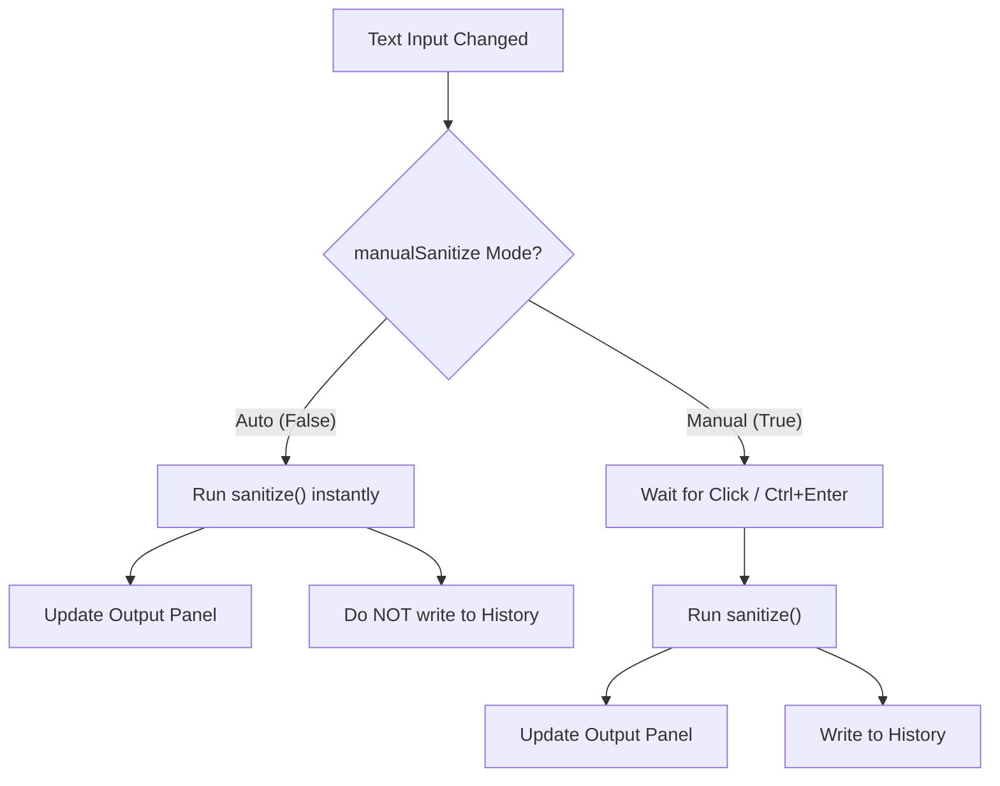

# Proposed Feature Integration Assessment & Plan

We have assessed the current codebase (where Phases 1–6 are complete) and evaluated the integration of your requested features. Below is a comprehensive analysis of the complexity, implementation details, and recommended scheduling for each item.

---

## 1. Feature Assessment & Complexity Matrix

| Feature | Description | Complexity | Suggested Placement | Rationale |
|---|---|---|---|---|
| **1. Centralized Styling & Components** | Standardize colors, borders, selection styles under CSS variables in `globals.css`. Create standalone reusable `Button` and `Alert/Notice` components in `src/components/shared/`. | **Low-Medium** | **Phase 6.5 (Immediate)** | Standardizing styling now prevents duplicate work on the Phase 7 Admin Dashboard. The admin panel can use the new component library from the start. |
| **2. Multi-Theme Dropdown (Hover)** | Add themes (e.g., *Sepia*, *Forest*, *Oceanic*) using CSS variable overrides. Update the navbar toggle button to display a hover-triggered, curved list of theme selectors. | **Medium** | **Phase 6.6 (Immediate)** | Follows the styling centralization. Tying custom properties directly to theme classes avoids adding heavy external libraries like daisyUI that might conflict with our custom UI styles. |
| **3. Automatic Real-Time Sanitization** | Real-time sanitization by default, hiding the sanitize button. History requires clicking the sanitize button, so the history page prompts the user to enable manual mode when auto mode is active. Settings has a manual toggle. | **Medium** | **Phase 6.7 (Immediate)** | Requires adjusting core state flow across `page.tsx`, the history page, and the settings page. Best completed before the admin panel is constructed. |
| **4. Future "Save Message" Session** | An icon button in the sanitizer toolbar that copies the tab's state into a "Saved" array in local storage, viewable on a separate page. | **Low-Medium** | **Phase 11 (Post-Release)** | Marked as a future phase. We will ensure the workspace data model and panel footers are structurally ready to accept this addition without breaking current flows. |

---

## 2. Technical Implementation Specifications

### 2.1 Feature 1: Centralized Styling & Reusable Components
To establish a true "single source of truth" for the styling system, we will:
1. **Extend CSS Variables**: Declare all layout variables inside `src/app/globals.css`, including specific UI attributes requested (e.g., text selection background, warning borders, and button-type states).
2. **Remove Hardcoded Visual Styles**: Eliminate inline colors (such as `#004AAD` in `InputPanel.tsx`) and standard Tailwind colors that should dynamically adapt to themes (like `border-outline-variant`).
3. **Build Reusable Components**:
   - Create `src/components/shared/Button.tsx` to encapsulate all button types:
     ```tsx
     interface ButtonProps extends React.ButtonHTMLAttributes<HTMLButtonElement> {
       variant?: 'primary' | 'secondary' | 'outline' | 'ghost' | 'danger-outline' | 'danger-filled';
       size?: 'sm' | 'md' | 'lg';
     }
     ```
   - Create `src/components/shared/Alert.tsx` for warning banners and notices (used in history, settings, and popups).

### 2.2 Feature 2: Multi-Theme Dropdown (CSS Variables vs. daisyUI)
> [!IMPORTANT]
> **Recommendation against daisyUI:** We highly recommend styling additional themes using CSS variable overrides under class names (e.g., `.theme-forest`) in `globals.css` rather than bringing in daisyUI. 
> Since we already have a robust CSS-variable system that maps to Tailwind utility classes, introducing daisyUI's class-resets could override your custom styles, custom scrollbars, and focus-ring states, causing visual regressions.

**How the CSS Variable Theme Approach Works:**
- Declare theme blocks in `globals.css`:
  ```css
  .theme-sepia {
    --brand: #8c5a3c;
    --brand-hover: #754b31;
    --surface: #f4ecd8;
    --surface-2: #e8ddc4;
    --surface-dim: #ebdcb9;
    --text: #433422;
    --text-muted: #826e58;
    --border: #d4c5a9;
  }
  .theme-forest {
    --brand: #15803d;
    --brand-hover: #166534;
    --surface: #f0fdf4;
    /* ... */
  }
  ```
- **Theme Selector Interaction:**
  - Create a custom dropdown component inside the Navbar theme button.
  - Implement hover triggers (`onMouseEnter`/`onMouseLeave`) with a standard delay (e.g., 200ms debounce) to prevent accidental closure.
  - Inside the dropdown, present themes as small, rounded rectangular cards showing color palettes. Clicking one toggles the HTML class and stores the value in `localStorage`.

### 2.3 Feature 3: Automatic Real-Time Sanitization Mode
To coordinate this mode between the main text workspace, the history page, and the settings page, we will establish a `manualSanitize` setting state:



- **Sanitizer Page:**
  - When `manualSanitize` is disabled, the sanitize button in the `InputPanel` is hidden. Typing or pasting text triggers sanitization on the fly.
  - When enabled, the sanitize button operates exactly as it does now.
- **Settings Page:**
  - A dedicated section under **Preferences** allowing users to toggle between "Real-Time (Auto)" and "On-Demand (Manual)" modes.
- **History Page:**
  - If a user opens the History page while in Auto mode, they will see an overlay card informing them: 
    > *"In order to see history you have to enable the sanitize button. (Real-time transformations are not saved to prevent history bloat.)"*
  - The card features a primary action button: **[Enable Sanitize Button]**. Clicking it changes `manualSanitize` to `true`, revealing the history log immediately.

### 2.4 Feature 4: Future "Save Message" Session
To ensure the codebase is structured to accept the "Save Message" feature later, we will:
1. Ensure the tab state format in `useTabs` exposes a clean payload containing the active tab's metadata.
2. Structure the data utilities in `src/lib/storage.ts` to support a `savedSessions` key parallel to the `history` logic.
3. Design action bars with modular flex alignments so that adding a "Save" icon button next to "Copy" / "Reinput" won't cause layout breakage.

---

## 3. Revised Integration Roadmap

To preserve project stability, we propose executing these features sequentially as pre-admin phases:

```
[Phase 6: Backend Complete] (Current Status)
        │
        ▼
[Phase 6.5: Centralized Styling Refactor]  <-- Build Button/Alert components, global tokens
        │
        ▼
[Phase 6.6: Multi-Theme Hover Dropdown]   <-- Theme presets + Navbar interactive tooltip
        │
        ▼
[Phase 6.7: Automatic Sanitizer Mode]     <-- Auto-run state, Settings toggle, History lock
        │
        ▼
[Phase 7: Admin Dashboard]                <-- Build admin panel directly using the new components
        │
        ▼
[Phase 8 & 9: Popup/Ads/SEO Pages]
        │
        ▼
[Phase 10: Polish & Deploy]
        │
        ▼
[Phase 11: Future Save-Session Feature]
```

---

### Key Questions for the User:
1. Do you agree with the **CSS-variable override** approach for the extra themes instead of installing daisyUI, or would you still prefer daisyUI?
2. Does the suggested **Phase 6.5 - 6.7** scheduling align with your development preferences?
